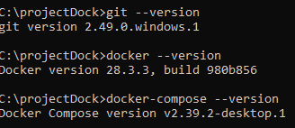
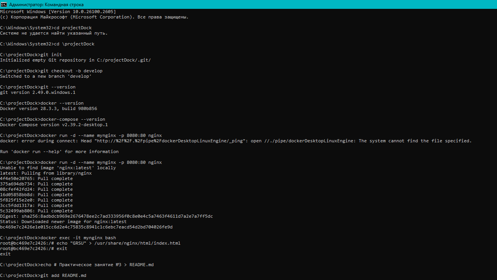

Выполненные шаги
1. Создание репозитория
Создал папку для проекта.
Инициализировал Git-репозиторий:
git init
git checkout -b develop

2. Установка Git
Проверил версию:
git --version

3. Установка Docker
Скачал Docker Desktop для Windows с сайта docker.com.
Установил и запустил Docker Desktop.
Проверил версию:
docker --version

4. Установка Docker Compose
Установил Docker Compose через консоль.
Проверил версию:
docker-compose --version

5. Скриншоты
Сделал скриншоты с выводом версий Git, Docker и Docker Compose.
6. Запуск контейнера с Nginx
Запустил контейнер:
docker run -d --name mynginx -p 8080:80 nginx

Открыл сайт в браузере по адресу http://localhost:8080 — отобразилась стандартная страница Nginx.
7. Изменение главной страницы
Зашёл внутрь контейнера:
docker exec -it mynginx bash

Заменил содержимое главной страницы:
echo "GRGU" > /usr/share/nginx/html/index.html
exit

В браузере по адресу http://localhost:8080 теперь отображается текст GRGU.
8. Добавление README.md
Создал файл README.md и описал шаги выполнения практики.
9. Сохранение изменений
Добавил файлы в Git и сделал коммит:
git add .
git commit -m "Практическое занятие №3"

Отправил изменения в ветку develop:
git push origin develop

### versions 

### process
